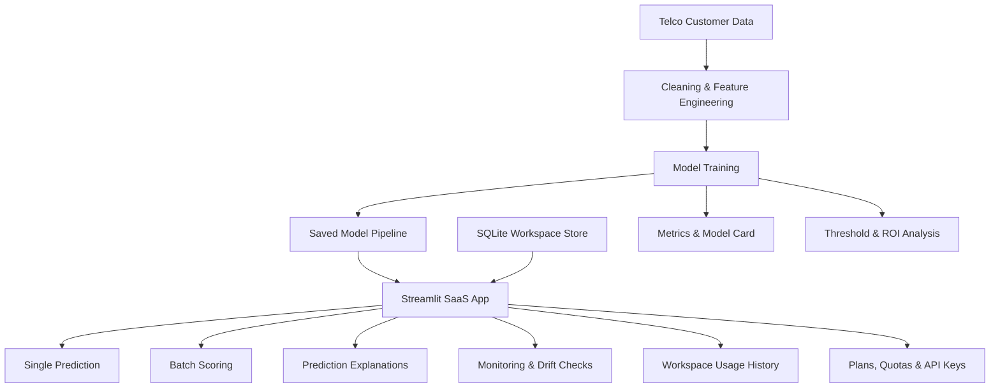

# ChurnGuard AI - Customer Retention Analytics SaaS


ChurnGuard AI is an end-to-end machine learning case study packaged as a Streamlit SaaS prototype. It predicts telecom customer churn, recommends retention actions, tracks scoring activity by workspace, enforces plan-based usage limits, manages demo API keys, and monitors model quality through batch scoring, explanations, and drift checks.

<p align="center">
  
</p>

## Live Demo

**Live Application:**
https://customer-churn-strategy.streamlit.app/

---

## Dataset

**Telco Customer Churn Dataset (IBM Sample Data)**

Dataset Source:
https://www.kaggle.com/datasets/blastchar/telco-customer-churn

The dataset contains customer demographics, subscription details, service usage information, billing records, tenure history, and churn labels used to predict customer attrition.

### Dataset Overview

| Attribute       | Value                 |
| --------------- | --------------------- |
| Industry        | Telecommunications    |
| Customers       | 7,043                 |
| Features        | 21                    |
| Churn Rate      | 26.5%                 |
| Problem Type    | Binary Classification |
| Target Variable | Churn                 |

Important features include:

* Contract Type
* Monthly Charges
* Total Charges
* Tenure
* Internet Service
* Payment Method
* Online Security
* Tech Support
* Streaming Services
* Senior Citizen Status

---

## Current Project Status

The repository currently includes:

* Trained churn prediction pipeline (`models/churn_pipeline.joblib`)
* Interactive Streamlit SaaS application
* Workspace authentication and management
* Subscription plans and scoring quotas
* API key generation and management
* Individual and batch prediction workflows
* Local prediction explanations
* Drift monitoring and quality checks
* Automated testing suite
* GitHub Actions CI pipeline

---

## Key Results

| Metric                         |                        Value |
| ------------------------------ | ---------------------------: |
| Dataset Rows                   |                        7,043 |
| Dataset Columns                |                           21 |
| Churn Rate                     |                        26.5% |
| Selected Model                 | Balanced Logistic Regression |
| Operating Threshold            |                          31% |
| Recall                         |                        92.5% |
| Precision                      |                        43.4% |
| ROC-AUC                        |                        0.841 |
| Accuracy                       |                        65.9% |
| Estimated Validation Net Value |                       $5,760 |

The operating threshold is optimized for retention value rather than accuracy alone. The model prioritizes recall so likely churners are less likely to be missed.

---

## Key Features

* Customer churn prediction
* Retention action recommendations
* Batch CSV scoring
* Local prediction explanations
* Drift monitoring
* Workspace management
* API key management
* Subscription plans and quotas
* Usage analytics
* Downloadable prediction reports

---

## Product Capabilities

* Demo sign-in and workspace creation
* Starter, Growth, and Scale subscription plans
* Monthly scoring quota checks
* API key generation and authentication
* Individual churn prediction with risk tier and recommended action
* Local prediction explanations
* Batch CSV scoring with downloadable results
* Workspace scoring history
* Usage analytics
* Model validation metrics and confusion matrix
* Batch data drift checks
* Required batch-column reference inside the application

---

## Demo Walkthrough


The application supports a practical retention workflow: sign in, score a customer or upload a batch file, review recommended retention actions, inspect explanations, monitor drift, and track workspace activity.

---

## Architecture



---

## Project Structure

```text
.
├── app.py
├── data/
│   └── telco_churn.csv
├── models/
│   ├── churn_pipeline.joblib
│   ├── churn_model.pkl
│   └── feature_columns.pkl
├── notebooks/
│   └── customer_churn_case_study.ipynb
├── reports/
│   ├── model_card.md
│   ├── model_metrics.json
│   └── resume_bullets.md
├── scripts/
│   └── train_model.py
├── src/
│   ├── business.py
│   ├── config.py
│   ├── data.py
│   ├── features.py
│   ├── inference.py
│   ├── monitoring.py
│   └── saas.py
├── tests/
│   ├── conftest.py
│   └── test_pipeline.py
├── .github/
│   └── workflows/
│       └── ci.yml
├── sample_batch_input.csv
├── DEPLOYMENT.md
├── README.md
└── requirements.txt
```

---

## Modeling Approach

1. Load the Telco Customer Churn dataset.
2. Clean numeric and categorical fields.
3. Convert `TotalCharges` and `SeniorCitizen` into model-ready values.
4. Remove `customerID` to prevent identifier leakage.
5. Apply imputation, scaling, and one-hot encoding through a scikit-learn pipeline.
6. Train Logistic Regression and Random Forest candidates.
7. Compare validation metrics and retention ROI.
8. Select the balanced Logistic Regression model.
9. Optimize the operating threshold for retention value.
10. Save the trained pipeline for production inference.

---

## Validation Metrics

The selected Logistic Regression model uses a 31% operating threshold.

| Metric           |                     Value |
| ---------------- | ------------------------: |
| Accuracy         |                     65.9% |
| Precision        |                     43.4% |
| Recall           |                     92.5% |
| ROC-AUC          |                     0.841 |
| Confusion Matrix | `[[583, 452], [28, 346]]` |

### ROI Simulation

| ROI Metric            |   Value |
| --------------------- | ------: |
| Contacted Customers   |     798 |
| True Positives        |     346 |
| False Positives       |     452 |
| False Negatives       |      28 |
| Estimated Saved Value | $46,710 |
| Campaign Cost         | $35,910 |
| Missed Churn Cost     |  $5,040 |
| Net Value             |  $5,760 |

---

## Tech Stack

* Python 3.11
* Pandas
* NumPy
* Scikit-learn
* Streamlit
* SQLite
* Joblib
* Pytest
* GitHub Actions

---

## How To Run Locally

Create and activate a virtual environment:

```bash
python -m venv .venv
.venv\Scripts\activate
```

Install dependencies:

```bash
pip install -r requirements.txt
```

Train or refresh the model:

```bash
python scripts/train_model.py
```

Launch the Streamlit application:

```bash
streamlit run app.py
```

Run automated tests:

```bash
pytest -q
```

Sample batch file:

```text
sample_batch_input.csv
```

---

## Testing & CI

The automated test suite validates:

* Model loading and inference
* Probability scoring
* Local explanations
* Drift monitoring output
* Workspace scoring persistence
* Plan limit enforcement
* API key functionality

Continuous Integration runs automatically on pushes and pull requests through GitHub Actions.

---

## Resume Highlights

* Built and deployed ChurnGuard AI, a Streamlit SaaS-style customer retention analytics platform.
* Developed a churn prediction pipeline using telecom customer subscription and billing data.
* Achieved ROC-AUC of 0.841 and recall of 92.5% using a balanced Logistic Regression model.
* Optimized operating thresholds using ROI-based retention campaign analysis.
* Implemented batch scoring, local explanations, drift monitoring, workspace management, API key handling, and GitHub Actions CI.

---

## Deployment

The application is deployment-ready for Streamlit Community Cloud.

* Repository: https://github.com/hemant2186/customer-churn-risk-analysis
* Branch: `main`
* Main File: `app.py`
* Dependencies: `requirements.txt`
* Model Artifact: `models/churn_pipeline.joblib`

See `DEPLOYMENT.md` for deployment instructions.

---

## Production Roadmap

Future improvements include:

* Managed authentication (Auth0, Clerk, Streamlit SSO)
* PostgreSQL persistence with tenant isolation
* Stripe-based subscription billing
* FastAPI scoring service
* Organization roles and permissions
* Audit logging
* Automated drift monitoring reports
* Real retention campaign outcome tracking

---

## Links

### Live Application

https://customer-churn-strategy.streamlit.app/

### GitHub Repository

https://github.com/hemant2186/customer-churn-risk-analysis

### Dataset

https://www.kaggle.com/datasets/blastchar/telco-customer-churn

---

## License

This project is licensed under the MIT License.
