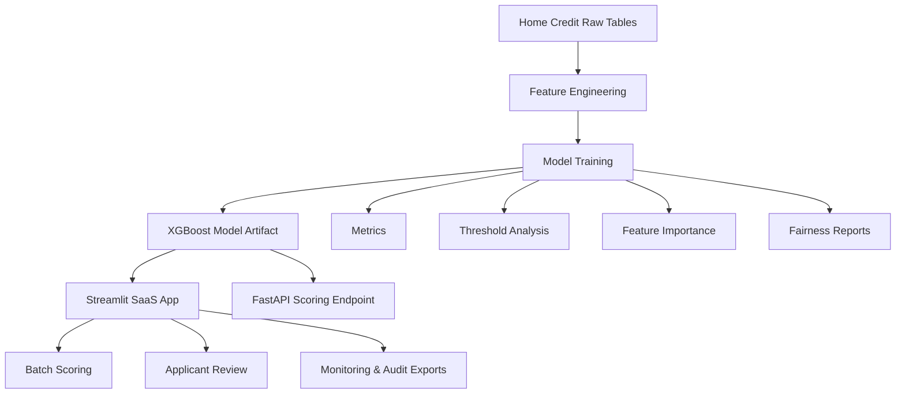

# CreditRisk AI - Credit Risk SaaS


CreditRisk AI is a deployable Streamlit SaaS-style application for borrower default-risk scoring. It enables lenders and analysts to upload applicant datasets, predict default probability in batch, tune lending thresholds, download decisions, and monitor model performance through an intuitive interface.

<p align="center">
  
</p>

## Live Demo

**Live Application:**
https://credit-risk-loan.streamlit.app/

## Dataset

**Home Credit Default Risk (Kaggle)**
https://www.kaggle.com/competitions/home-credit-default-risk

The dataset contains borrower application records, bureau history, installment payments, POS cash balances, credit card balances, and previous loan applications used to predict loan default risk.


---

# Demo

## Application Dashboard


The main dashboard provides portfolio-level credit risk insights, model health metrics, operating thresholds, and high-risk borrower summaries.

---

## Batch Scoring


Upload borrower datasets and generate default-risk predictions in batch with downloadable decision outputs and audit logs.

---

## Applicant Review


Review individual borrower profiles, default probabilities, and lending recommendations for manual credit review workflows.

---

## Analytics


Compare model performance, evaluate threshold tradeoffs, and inspect feature importance for model explainability.

---

## Monitoring Dashboard


Track score distributions, risk-band mix, drift-watch features, and fairness indicators to support responsible AI monitoring.


---

# Key Results

* **307,511** borrower records processed
* **324** engineered features
* **8.1%** default rate
* **ROC-AUC: 0.781** (Best Model)
* **Recall: 0.690**
* **Best Model:** XGBoost
* **Production Features:** Monitoring, Audit Logs, Fairness Reports, FastAPI Endpoint

---

# Architecture



---

# Business Impact

* Automates borrower risk assessment workflows.
* Enables threshold tuning for different lending strategies.
* Supports analyst review and decision-making.
* Provides audit logs for governance and traceability.
* Includes fairness and monitoring reports for responsible AI practices.
* Demonstrates production-style machine learning deployment.

---

# Tech Stack

* Python
* Pandas
* NumPy
* Scikit-learn
* XGBoost
* Streamlit
* FastAPI
* Matplotlib

---

# Product Capabilities

* Batch applicant scoring from uploaded CSV files
* Downloadable scored applicant output
* Threshold policy testing
* Single-applicant review workflow
* Model comparison and evaluation reports
* Feature importance reporting
* Monitoring dashboard
* Audit-log exports
* Fairness summary reports
* Optional FastAPI integration endpoint

---

# SaaS Workflow

1. Upload borrower-level applicant data.
2. Validate and align the schema with model requirements.
3. Generate default-risk probabilities.
4. Apply configurable decision thresholds.
5. Download scored applicant decisions.
6. Export audit logs for governance.
7. Review monitoring and fairness reports.

---

# Internship Readiness

This project demonstrates:

* End-to-end machine learning delivery
* Multi-table feature engineering
* Imbalanced classification modeling
* Business-focused threshold optimization
* Model explainability
* Cloud deployment and reproducibility
* Monitoring and governance tooling
* API serving and production-inspired architecture

---

# Project Structure

```text
.
├── .streamlit/
├── api.py
├── app.py
├── data/
│   ├── raw/
│   └── processed/
├── models/
├── notebooks/
├── reports/
├── src/
├── MODEL_CARD.md
├── DEPLOYMENT.md
└── requirements.txt
```

---

# Modeling Workflow

1. Load `application_train.csv`
2. Aggregate features from:

   * previous_application.csv
   * bureau.csv
   * bureau_balance.csv
   * installments_payments.csv
   * POS_CASH_balance.csv
   * credit_card_balance.csv
3. Merge engineered features into the borrower table.
4. Split train and test sets with stratification.
5. Train:

   * Logistic Regression
   * Random Forest
   * XGBoost
6. Save the best-performing model.
7. Tune decision thresholds.
8. Deploy through Streamlit.
9. Generate explainability reports.
10. Generate fairness and monitoring artifacts.

---

# Model Performance

| Model               | Accuracy | Precision | Recall | F1 Score | ROC-AUC |
| ------------------- | -------- | --------- | ------ | -------- | ------- |
| Logistic Regression | 0.747    | 0.183     | 0.615  | 0.282    | 0.755   |
| Random Forest       | 0.647    | 0.140     | 0.654  | 0.231    | 0.707   |
| XGBoost             | 0.730    | 0.185     | 0.690  | 0.292    | 0.781   |

**Best Saved Model:** `models/home_credit_xgboost.joblib`

---

# Threshold Tuning

* Best F1 Threshold: `0.70`
* Business Threshold: `0.55`

The model achieves the highest F1 score at a threshold of 0.70. A lower threshold of 0.55 improves recall and may be preferable when reducing missed defaults is more important than maximizing precision.

---

# Deployment Status

* Live App: https://credit-risk-loan.streamlit.app/
* Primary Model: XGBoost
* Cloud Fallback: Logistic Regression
* Recommended Runtime: Python 3.11

---

# Production-Style Controls

### Monitoring

* Score distribution tracking
* Risk-band distribution analysis
* Drift-watch features

### Audit Logging

* Timestamp
* Applicant ID
* Threshold used
* Risk score
* Decision outcome
* Model source

### Fairness Analysis

* Average score comparison
* High-risk rate comparison
* Default-rate comparison across groups

### API Endpoint

* `/health`
* `/schema`
* `/score`

---

# Product Screenshots

### Application Dashboard

*Add screenshot*

### Model Comparison


### Threshold Tradeoff


### Feature Importance


---

# Key Files

* `src/train_home_credit.py` — model training and feature engineering
* `src/threshold_tuning.py` — threshold optimization
* `src/explain_model.py` — explainability reports
* `app.py` — Streamlit application
* `api.py` — FastAPI endpoint
* `MODEL_CARD.md` — model documentation
* `DEPLOYMENT.md` — deployment instructions

---

# How To Run Locally

Install dependencies:

```bash
python -m pip install -r requirements.txt
```

Train models:

```bash
python -m src.train_home_credit
```

Run threshold tuning:

```bash
python -m src.threshold_tuning
```

Generate explainability artifacts:

```bash
python -m src.explain_model
```

Generate fairness reports:

```bash
python -m src.fairness_analysis
```

Launch Streamlit:

```bash
streamlit run app.py
```

Launch API:

```bash
uvicorn api:app --reload
```

---

# Resume Highlights

* Built and deployed CreditRisk AI, a Streamlit SaaS-style credit-risk scoring platform.
* Engineered borrower-level features across six Home Credit relational datasets.
* Compared Logistic Regression, Random Forest, and XGBoost models, achieving ROC-AUC of 0.781.
* Implemented threshold optimization for lending-policy tradeoffs.
* Added monitoring, audit logging, fairness analysis, and API serving to simulate production ML systems.

---

# Deployment

See `DEPLOYMENT.md` for deployment instructions.

Recommended Streamlit Cloud configuration:

* Repository: `hemant2186/credit-risk-loan-default-prediction`
* Branch: `main`
* Main File: `app.py`

---

# Links

**Live Application**

https://credit-risk-loan.streamlit.app/

**GitHub Repository**

https://github.com/hemant2186/credit-risk-loan-default-prediction
